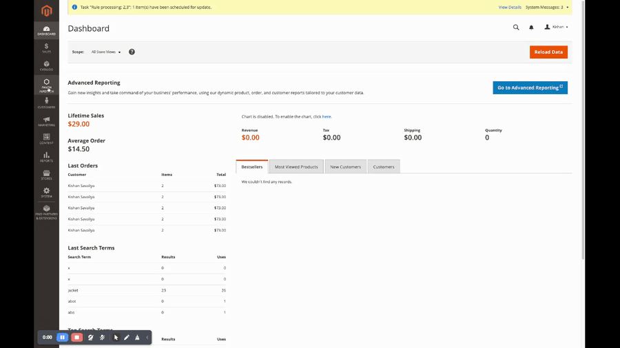
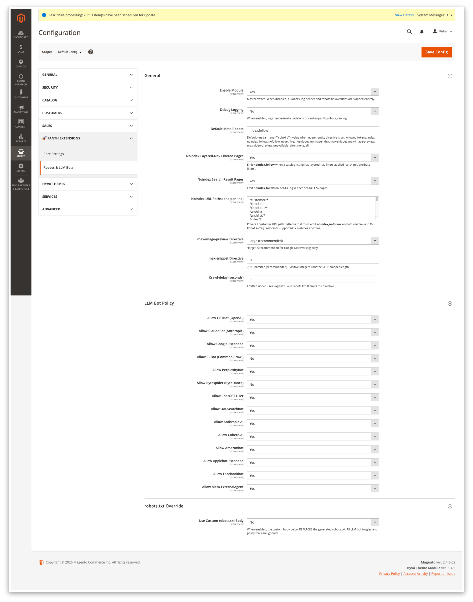
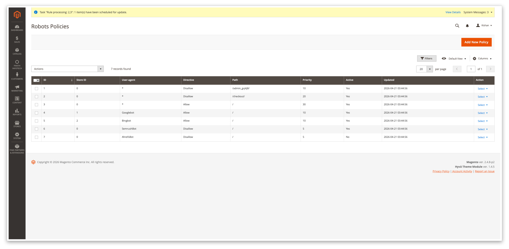
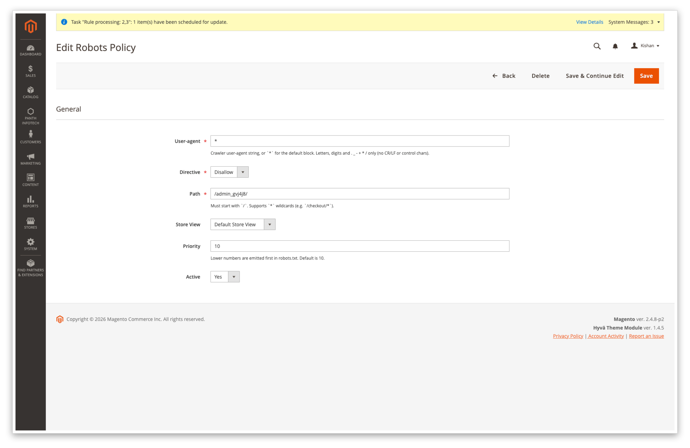
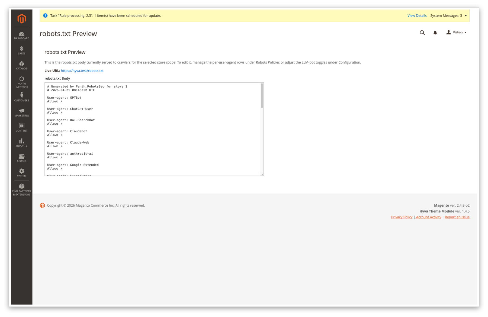

<!-- SEO Meta -->
<!--
  Title: Panth Robots SEO — Dedicated robots.txt, X-Robots-Tag & LLM Bot Policy for Magento 2 (Hyva + Luma)
  Description: Full control over robots.txt, X-Robots-Tag response headers, and LLM / AI crawler (GPTBot, ClaudeBot, PerplexityBot, Google-Extended, Bytespider, CCBot, Applebot-Extended, Meta-ExternalAgent, Amazonbot, Cohere-AI and more) policy for Magento 2. Dynamic per-store robots.txt with admin CRUD policy rows, status-code-aware X-Robots-Tag header, noindex path matcher, layered-nav and catalogsearch noindex, non-HTML asset noindex, CRLF-injection-safe directive validator, and custom robots.txt body override. Works identically on Hyva and Luma. Extracted from Panth_AdvancedSEO for standalone installation.
  Keywords: magento 2 robots.txt, magento 2 x-robots-tag, magento 2 llm bots, magento 2 ai crawler policy, magento gptbot, magento claudebot, magento perplexitybot, magento google-extended, magento 2 noindex, magento 2 layered nav noindex, magento 2 catalogsearch noindex, magento 2 seo headers, magento robots meta, hyva robots seo, luma robots seo, magento crlf header injection
  Author: Kishan Savaliya (Panth Infotech)
-->

# Panth Robots SEO — Dedicated robots.txt, X-Robots-Tag & LLM Bot Policy for Magento 2 (Hyva + Luma)

[](https://magento.com)
[](https://php.net)
[](https://hyva.io)
[]()
[](https://packagist.org/packages/mage2kishan/module-robots-seo)
[](https://www.upwork.com/freelancers/~016dd1767321100e21)
[](https://kishansavaliya.com)
[](https://kishansavaliya.com/get-quote)

> **Complete robots and crawler-policy control for Magento 2.** One module takes over `/robots.txt` at the router layer, emits an `X-Robots-Tag` HTTP response header on every frontend HTML page, adds per-user-agent allow/disallow rows via an admin grid, and toggles fourteen modern LLM / AI crawlers (GPTBot, ClaudeBot, PerplexityBot, Google-Extended, Bytespider, CCBot, Applebot-Extended, Meta-ExternalAgent, Amazonbot, Cohere-AI, and more) with a single click. Every directive passes a CRLF-safe validator before it ever reaches the wire. Works identically on **Hyva** and **Luma**.

Magento's native robots handling is three things that no longer add up: a **static `robots.txt` file** on disk, a **single admin textarea** buried under *Content → Design → Configuration* that overwrites it, and **no `X-Robots-Tag` header control** whatsoever. There is also no UI for the new generation of AI crawlers — GPTBot, ClaudeBot, PerplexityBot, Google-Extended, Bytespider — so stores either open their data to every model trainer by default or hand-edit the file on every deploy. **Panth Robots SEO** unifies all three layers (robots.txt body, robots meta, `X-Robots-Tag` header) into one coherent admin surface with a dedicated controller, a declarative schema-backed policy grid, and a directive validator that makes CRLF header injection structurally impossible.

---

## Need Custom Magento 2 Development?

<p align="center">
  <a href="https://kishansavaliya.com/get-quote">
    
  </a>
</p>

<table>
<tr>
<td width="50%" align="center">

### Kishan Savaliya
**Top Rated Plus on Upwork**

[](https://www.upwork.com/freelancers/~016dd1767321100e21)

</td>
<td width="50%" align="center">

### Panth Infotech Agency

[](https://www.upwork.com/agencies/1881421506131960778/)

</td>
</tr>
</table>

---

## Table of Contents

- [Preview](#preview)
- [Features](#features)
- [How It Works](#how-it-works)
- [Supported LLM Bots](#supported-llm-bots)
- [Compatibility](#compatibility)
- [Installation](#installation)
- [Configuration](#configuration)
- [Managing Robots Policies](#managing-robots-policies)
- [robots.txt Endpoint](#robotstxt-endpoint)
- [X-Robots-Tag Header](#x-robots-tag-header)
- [Security](#security)
- [Troubleshooting](#troubleshooting)
- [Support](#support)

---

## Preview

### Live walkthrough

End-to-end admin flow — enable the module, toggle a few LLM bots, add a policy row, preview the generated `robots.txt`, curl `/robots.txt` on both Hyva and Luma, and confirm the `X-Robots-Tag` header on a customer-account page. Click to play.



### Admin

**Global configuration** — toggle the module, pick the default `<meta name="robots">` value, configure layered-nav and catalogsearch noindex, edit the noindex path list, set `max-image-preview` / `max-snippet` / `Crawl-delay`.



**Robots Policies grid** — one row per (user-agent, path, directive, store_id) tuple. Filter by store, mass-enable / disable / delete, inline priority column so the evaluator knows which rule wins when two patterns overlap.



**Edit form — policy row** — pick a user-agent (`*` for the default block, or `GPTBot`, `ClaudeBot`, a custom UA, etc.), pick allow / disallow, enter a path, scope to a store view, set priority and active flag. The UA and path fields are validated against a whitelist regex before save.



**robots.txt preview** — dedicated **Panth Infotech → Robots & LLM Bots → robots.txt Preview** page renders the live body exactly as the frontend will serve it, with a store-switcher so you can verify each store view before rolling to production.



### Storefront — Hyvä

**`/robots.txt`** — served by our controller, LLM-bot `Disallow: /` blocks at the top, default `User-agent: *` block, admin policy rows, then `Sitemap:` and `Host:` lines.


### Storefront — Luma

**`/robots.txt`** — identical output on Luma; the module is theme-agnostic because it only emits HTTP headers and plain text.


---

## Features

| Feature | Description |
|---|---|
| **Dynamic `/robots.txt` per store view** | Built on the fly from LLM-bot toggles (emitted as `User-agent: <bot>\nDisallow: /` blocks when disabled), a `User-agent: *` block with admin policy rows and `Crawl-delay`, then `Sitemap:` and `Host:` lines. No static file ever leaves disk. |
| **14 LLM / AI crawler toggles** | One-click allow/disallow for GPTBot (`GPTBot`), ChatGPT-User (`ChatGPT-User`), OAI-SearchBot (`OAI-SearchBot`), ClaudeBot (maps both `ClaudeBot` and `Claude-Web`), Anthropic-AI (`anthropic-ai`), Google-Extended (maps both `Google-Extended` and `GoogleOther`), PerplexityBot (`PerplexityBot`), Cohere-AI (`cohere-ai`), CCBot (`CCBot`), Bytespider (`Bytespider`), Amazonbot (`Amazonbot`), Applebot-Extended (`Applebot-Extended`), FacebookBot (`FacebookBot`), Meta-ExternalAgent (`meta-externalagent`). |
| **`X-Robots-Tag` response header** | Added to every frontend HTML response by `Plugin\Response\XRobotsTagPlugin` with `max-image-preview:<large\|standard\|none>` and `max-snippet:<int>` appended to the chosen directive. Handled before `Response::sendResponse()` so the header is always present. |
| **Noindex path matcher** | `Service\NoindexPathMatcher` walks an admin-editable list of path patterns (`*` wildcards supported). Defaults cover `/customer/*`, `/checkout*`, `/wishlist*`, `/sales/*`, `/contact*`, `/catalogsearch/*`, `/multishipping/*`, `/newsletter/manage*`, `/review/customer/*`, `/captcha*`, `/sendfriend/*`, `/paypal/*`, `/downloadable/customer/*`, `/vault/*`, `/giftcard/customer/*`, `/rewards/*`, `/oauth/*`, `/connect/*`. |
| **Layered-nav / sort-filter noindex** | When a catalog listing has any `?p=`, `?dir=`, `?order=`, `?limit=`, or layered-nav attribute query parameter, the header flips to `noindex, follow` so filtered permutations don't dilute the canonical listing. |
| **Catalogsearch noindex** | `/catalogsearch/result/*` pages emit `noindex, follow` by default — searches are inherently ephemeral and shouldn't be indexed. |
| **HTTP-status-aware override** | 404, 410, 500 and 503 responses hard-override the header to `noindex, nofollow` regardless of config, so error pages can never leak into the index. |
| **Non-HTML asset noindex** | Requests ending in `.pdf`, `.doc`, `.docx`, `.xls`, `.xlsx` emit `noindex, nofollow` — stops support docs and spec sheets from displacing the canonical product page in the SERP. |
| **`robots.txt` custom-body override** | `robots_txt/override_enabled = 1` pastes `robots_txt/custom_body` verbatim into the response and skips the entire generation pipeline. CRLF is normalised to LF on write. |
| **Admin CRUD grid** | `panth_seo_robots_policy` table with a full UI-component grid — per-UA, per-path, per-store-view allow/disallow rows with priority and active flag. Dedicated **robots.txt Preview** admin page renders the live output. |
| **CRLF-injection-safe** | Every directive string passes `Service\DirectiveValidator` (printable-ASCII whitelist, rejects `\r`, `\n`, `\0`). Every path and UA is validated against a whitelist regex before the DB write. |

---

## How It Works

Seven cooperating pieces:

1. **`Controller\Robots\Index`** at route `seo_robots/robots/index` serves `GET /robots.txt` with the generated or override body, `Content-Type: text/plain; charset=utf-8`.
2. **`Setup\Patch\Data\InstallRobotsTxtRewrite`** writes the `url_rewrite` row that maps `/robots.txt` to the module controller at install time; **`RefreshRobotsTxtRewrite`** re-points an existing stale target_path row left behind by Panth_AdvancedSEO so upgrades are a no-op.
3. **`etc/frontend/di.xml`** disables the core `Magento\Framework\App\RouterList` entry for `robots` — Magento's built-in robots router no longer intercepts `/robots.txt` before the url_rewrite layer, so our controller wins.
4. **`Plugin\Response\XRobotsTagPlugin`** is a `beforeSendResponse` plugin on `Magento\Framework\App\Response\Http`. It inspects the request path, status code, and rendered Content-Type, then sets `X-Robots-Tag` once per response.
5. **`Model\Robots\PolicyResolver`** aggregates `panth_robots_seo/llm_bots/*` toggles + rows from `panth_seo_robots_policy` + the configured `Crawl-delay` + `Sitemap:` references into the final robots.txt body for a given store.
6. **`Model\Robots\MetaResolver`** computes the per-entity robots meta string — used by the plugin and (when `Panth_AdvancedSEO` is present) by the shared `panth_seo_resolved.robots` cache column.
7. **`Service\NoindexPathMatcher`** + **`Service\DirectiveValidator`** — the first decides whether a given request path is "private"; the second is the single chokepoint every directive string passes through before it hits a response header or the robots.txt body.

---

## Supported LLM Bots

Per-bot allow/disallow lives at **Stores → Configuration → Panth Infotech → Robots & LLM Bots → LLM Bot Policy**. Turning a toggle to **No** emits `User-agent: <bot>\nDisallow: /` in the generated robots.txt; turning it to **Yes** omits the block entirely (equivalent to allow).

| Bot | UA string(s) | Default | Config path |
|---|---|---|---|
| **GPTBot** (OpenAI) | `GPTBot` | Yes | `panth_robots_seo/llm_bots/gptbot` |
| **ChatGPT-User** | `ChatGPT-User` | Yes | `panth_robots_seo/llm_bots/chatgpt_user` |
| **OAI-SearchBot** | `OAI-SearchBot` | Yes | `panth_robots_seo/llm_bots/oai_searchbot` |
| **ClaudeBot** (Anthropic) | `ClaudeBot`, `Claude-Web` | Yes | `panth_robots_seo/llm_bots/claudebot` |
| **Anthropic-AI** | `anthropic-ai` | Yes | `panth_robots_seo/llm_bots/anthropic_ai` |
| **Google-Extended** | `Google-Extended`, `GoogleOther` | Yes | `panth_robots_seo/llm_bots/google_extended` |
| **PerplexityBot** | `PerplexityBot` | Yes | `panth_robots_seo/llm_bots/perplexitybot` |
| **Cohere-AI** | `cohere-ai` | Yes | `panth_robots_seo/llm_bots/cohere_ai` |
| **CCBot** (Common Crawl) | `CCBot` | **No** | `panth_robots_seo/llm_bots/ccbot` |
| **Bytespider** (ByteDance) | `Bytespider` | **No** | `panth_robots_seo/llm_bots/bytespider` |
| **Amazonbot** | `Amazonbot` | Yes | `panth_robots_seo/llm_bots/amazonbot` |
| **Applebot-Extended** | `Applebot-Extended` | Yes | `panth_robots_seo/llm_bots/applebot_extended` |
| **FacebookBot** | `FacebookBot` | Yes | `panth_robots_seo/llm_bots/facebookbot` |
| **Meta-ExternalAgent** | `meta-externalagent` | Yes | `panth_robots_seo/llm_bots/meta_externalagent` |

### Always allowed (no dedicated toggle)

The following bots are not blocked by default and have no dedicated config key. If you need to block them, add a `Disallow: /` row to the Robots Policies grid with the UA as the user-agent:

- **YouBot** — You.com's search crawler
- **PetalBot** — Huawei / Petal Search crawler
- **Diffbot** — knowledge-graph crawler
- **AI2Bot** — Allen Institute research crawler
- **Omgilibot** — Webz.io crawler
- **Timpibot** — Timpi decentralised search crawler

---

## Compatibility

| Requirement | Supported |
|---|---|
| Magento Open Source | 2.4.4, 2.4.5, 2.4.6, 2.4.7, 2.4.8 |
| Adobe Commerce | 2.4.4 — 2.4.8 |
| PHP | 8.1, 8.2, 8.3, 8.4 |
| Hyva Theme | 1.0+ (fully compatible) |
| Luma Theme | Native support |
| Panth Core | ^1.0 (installed automatically) |

---

## Installation

```bash
composer require mage2kishan/module-robots-seo
bin/magento module:enable Panth_Core Panth_RobotsSeo
bin/magento setup:upgrade
bin/magento setup:di:compile
bin/magento cache:flush
```

### Verify

```bash
bin/magento module:status Panth_RobotsSeo
# Module is enabled

curl -s -o /dev/null -w '%{http_code}\n' https://your-store.test/robots.txt
# 200

curl -sI https://your-store.test/customer/account/login | grep -i x-robots-tag
# X-Robots-Tag: noindex, nofollow, max-image-preview:large, max-snippet:-1
```

Visit **Admin → Panth Infotech → Robots & LLM Bots → Robots Policies** to see the seeded policy grid.

---

## Configuration

Navigate to **Stores → Configuration → Panth Infotech → Robots & LLM Bots**.

### General

| Setting | Path | Default | What it controls |
|---|---|---|---|
| **Enable Module** | `panth_robots_seo/general/enabled` | Yes | Master switch. When No, the `X-Robots-Tag` plugin is a no-op and `/robots.txt` serves a stock `User-agent: *\nAllow: /`. |
| **Debug Logging** | `panth_robots_seo/general/debug` | No | When Yes, every header and meta decision is written to `var/log/panth_robots_seo.log`. |
| **Default Meta Robots** | `panth_robots_seo/general/default_directive` | `index,follow` | Baseline directive applied when no per-entity / per-path override fires. Allowed tokens: `index`, `noindex`, `follow`, `nofollow`, `noarchive`, `nosnippet`, `noimageindex`, `max-snippet`, `max-image-preview`, `max-video-preview`, `unavailable_after`, `none`, `all`. |
| **Noindex Layered-Nav Filtered Pages** | `panth_robots_seo/general/noindex_filtered` | Yes | Emit `noindex, follow` when a catalog listing has layered-nav or sort/limit/page query parameters. |
| **Noindex Search Result Pages** | `panth_robots_seo/general/noindex_search_results` | Yes | Emit `noindex, follow` on `/catalogsearch/result/*`. |
| **Noindex URL Paths** | `panth_robots_seo/general/noindex_paths` | (18-line seeded list — see above) | One-path-per-line list of private patterns; `*` matches anything. Matched by `Service\NoindexPathMatcher`. |
| **max-image-preview Directive** | `panth_robots_seo/general/max_image_preview` | `large` | Appended to every `X-Robots-Tag`. `large` is recommended for Google Discover eligibility. |
| **max-snippet Directive** | `panth_robots_seo/general/max_snippet` | `-1` | `-1` = unlimited. A positive integer caps SERP snippet length. |
| **Crawl-delay (seconds)** | `panth_robots_seo/general/crawl_delay` | `0` | Emitted under `User-agent: *` in robots.txt. `0` omits the directive. |

### LLM Bot Policy

| Setting | Path | Default | What it controls |
|---|---|---|---|
| **Allow GPTBot (OpenAI)** | `panth_robots_seo/llm_bots/gptbot` | Yes | No = emits `User-agent: GPTBot\nDisallow: /`. |
| **Allow ClaudeBot (Anthropic)** | `panth_robots_seo/llm_bots/claudebot` | Yes | Covers both `ClaudeBot` and `Claude-Web`. |
| **Allow Google-Extended** | `panth_robots_seo/llm_bots/google_extended` | Yes | Covers both `Google-Extended` and `GoogleOther`. |
| **Allow CCBot (Common Crawl)** | `panth_robots_seo/llm_bots/ccbot` | **No** | CCBot feeds dataset-scale training pipelines; blocked by default. |
| **Allow PerplexityBot** | `panth_robots_seo/llm_bots/perplexitybot` | Yes | |
| **Allow Bytespider (ByteDance)** | `panth_robots_seo/llm_bots/bytespider` | **No** | Bytespider ignores partial disallows; blocked by default. |
| **Allow ChatGPT-User** | `panth_robots_seo/llm_bots/chatgpt_user` | Yes | |
| **Allow OAI-SearchBot** | `panth_robots_seo/llm_bots/oai_searchbot` | Yes | |
| **Allow Anthropic-AI** | `panth_robots_seo/llm_bots/anthropic_ai` | Yes | |
| **Allow Cohere-AI** | `panth_robots_seo/llm_bots/cohere_ai` | Yes | |
| **Allow Amazonbot** | `panth_robots_seo/llm_bots/amazonbot` | Yes | |
| **Allow Applebot-Extended** | `panth_robots_seo/llm_bots/applebot_extended` | Yes | |
| **Allow Facebookbot** | `panth_robots_seo/llm_bots/facebookbot` | Yes | |
| **Allow Meta-ExternalAgent** | `panth_robots_seo/llm_bots/meta_externalagent` | Yes | |

### robots.txt Override

| Setting | Path | Default | What it controls |
|---|---|---|---|
| **Use Custom robots.txt Body** | `panth_robots_seo/robots_txt/override_enabled` | No | When Yes, the custom body below REPLACES the generated output — every LLM toggle and policy row is ignored. |
| **Custom robots.txt Body** | `panth_robots_seo/robots_txt/custom_body` | (empty) | Pasted verbatim into the response. CRLF is normalised to LF to prevent HTTP header smuggling. Leave empty to use the generated output. |

Every setting resolves at **store-view** scope, so each store can have a different LLM policy, noindex path list, or override body.

---

## Managing Robots Policies

Open **Admin → Panth Infotech → Robots & LLM Bots → Robots Policies** to reach the grid (route `panth_robots_seo/policy/index`).

### Fields

| Field | Description |
|---|---|
| **User-agent** | The UA string to match — `*` for the default block, `GPTBot`, `ClaudeBot`, `Applebot-Extended`, a custom crawler, etc. Validated against `/^[A-Za-z0-9._\-+*\/ ]+$/` on save. |
| **Directive** | `allow` or `disallow`. Single source of truth consumed by `PolicyResolver`. |
| **Path** | The path fragment the directive applies to. Must start with `/`, no control bytes. `*` wildcards allowed. |
| **Store View** | `0` applies to all stores; a non-zero value scopes the row to one store view. Foreign-keyed to `store.store_id` with `ON DELETE CASCADE`. |
| **Priority** | Lower numbers are emitted first within the same user-agent block. |
| **Active** | Per-row enable/disable. Inactive rows are never rendered. |

### Mass actions

Select rows and choose **Enable**, **Disable** or **Delete** from the grid mass-action menu.

### robots.txt Preview

The **Panth Infotech → Robots & LLM Bots → robots.txt Preview** sub-menu (route `panth_robots_seo/robots/index`) renders the live body for the currently selected store, exactly as the frontend controller would serve it — helpful for dry-running changes before they go public.

---

## robots.txt Endpoint

- **URL:** `GET /robots.txt`
- **Content-Type:** `text/plain; charset=utf-8`
- **Controller:** `Panth\RobotsSeo\Controller\Robots\Index` at route `seo_robots/robots/index`.

`/robots.txt` is served by our controller via a `url_rewrite` row installed by `Setup\Patch\Data\InstallRobotsTxtRewrite`. The core `Magento_Robots` router is disabled via `etc/frontend/di.xml` so it never intercepts the request ahead of the url_rewrite layer.

If you are upgrading from `Panth_AdvancedSEO` where `/robots.txt` was already mapped to that module's controller, the `RefreshRobotsTxtRewrite` patch runs on the next `setup:upgrade` and rewrites the stale `target_path` to point at the new controller — zero manual DB surgery required.

### Generated body shape

```
User-agent: CCBot
Disallow: /

User-agent: Bytespider
Disallow: /

User-agent: *
Crawl-delay: 0
Disallow: /customer/
Disallow: /checkout/
Allow: /

Sitemap: https://your-store.test/sitemap.xml
Host: your-store.test
```

---

## X-Robots-Tag Header

`Plugin\Response\XRobotsTagPlugin` runs `beforeSendResponse` on `Magento\Framework\App\Response\Http` and applies the following order of precedence:

1. **Self-skip on `/robots.txt`** — never sets a header on the robots.txt response itself.
2. **Error-code override** — 404, 410, 500, 503 → hard `noindex, nofollow`, no further checks.
3. **Non-HTML asset override** — `.pdf`, `.doc`, `.docx`, `.xls`, `.xlsx` → hard `noindex, nofollow`.
4. **Catalogsearch noindex** — `/catalogsearch/result/*` when `noindex_search_results = Yes` → `noindex, follow`.
5. **Configured `noindex_paths` match** — `Service\NoindexPathMatcher` → `noindex, nofollow` (and the matching meta).
6. **Layered-nav / sort-filter** — when listing page has query parameters → `noindex, follow`.
7. **Default directive** — `panth_robots_seo/general/default_directive` (e.g. `index, follow`).

In every case the final string is appended with `, max-image-preview:<value>` and `, max-snippet:<int>` from general config, then passed through `Service\DirectiveValidator` before being set on the response.

---

## Security

- **ACL + FormKey on every admin controller.** Every Adminhtml controller extends `Panth\RobotsSeo\Controller\Adminhtml\AbstractAction`, declares its own `ADMIN_RESOURCE` constant (`Panth_RobotsSeo::policies`, `Panth_RobotsSeo::preview`), and enforces ACL via `_isAllowed()`. No route is reachable without a valid admin session.
- **`HttpPostActionInterface` on mutating paths.** `Save`, `Delete`, `MassDelete`, `MassStatus` all implement `HttpPostActionInterface` so GET is rejected at the framework level. Form-key validation runs on every POST.
- **`DirectiveValidator` whitelist + control-byte rejection.** Every directive string written to `X-Robots-Tag` or the robots.txt body passes through `Service\DirectiveValidator::assertSafe()` — rejects any string containing `\r`, `\n`, `\0`, or bytes outside printable-ASCII. CRLF header injection is structurally impossible.
- **CRLF normalisation in custom body.** `robots_txt/custom_body` has `\r\n` → `\n` normalisation applied on render so a pasted Windows-style newline can't smuggle a second response header.
- **Per-store scope on every config value.** `enabled`, `noindex_paths`, every `llm_bots/*` toggle, and the custom body resolve at `ScopeInterface::SCOPE_STORES` — a store-specific value never leaks into another store.
- **UA + path validation on save.** Admin policy rows reject user-agents outside `/^[A-Za-z0-9._\-+*\/ ]+$/` and paths that do not start with `/` or contain control bytes, before the row is written.
- **XSS-safe admin preview.** The robots.txt Preview page renders the body through `escapeHtml()` and wraps it in `<pre>` tags, so a hostile custom body can never execute script on an admin browser.

---

## Troubleshooting

### `/robots.txt` returns a 404 or a Luma 404 HTML page

You are likely sitting on a stale `url_rewrite` row left behind by `Panth_AdvancedSEO` whose `target_path` still points at the old controller. Run `bin/magento setup:upgrade` — the `RefreshRobotsTxtRewrite` patch fires idempotently and rewrites the row to the new target. Follow with `bin/magento cache:clean config full_page`.

### `X-Robots-Tag` not appearing on `/customer/*` pages

Upgrade to **≥ 1.0.2**. Earlier releases had a constructor-argument ordering bug that made the plugin skip the response when `Panth_AdvancedSEO` wasn't installed; 1.0.2 makes the dependency DI-nullable and the plugin always runs.

### LLM bot block missing from `robots.txt`

1. Check the toggle at the **right scope** — `panth_robots_seo/llm_bots/<bot>` resolves at store-view scope, not website or default.
2. Flush config + FPC: `bin/magento cache:clean config full_page`. The `/robots.txt` body is built live per request but the config it reads from is cached.
3. Confirm `robots_txt/override_enabled` is **No** — when the override is on, every LLM toggle is ignored.

### I turned on `override_enabled` but nothing changes

1. `bin/magento cache:clean config full_page` — the override flag and custom body are both pulled from cached config.
2. Confirm `custom_body` was saved at the **store scope** you are viewing, not the default scope. Check with `SELECT scope, scope_id, value FROM core_config_data WHERE path = 'panth_robots_seo/robots_txt/custom_body';`.

### Meta robots tag not showing in page HTML

The module sets the `X-Robots-Tag` **HTTP response header** — not the `<meta name="robots">` element. A layout hook that injects the `<meta>` tag into the page `<head>` is only wired when `Panth_AdvancedSEO` is also installed (it owns the `page/main` block override). If you need both, install `mage2kishan/module-advanced-seo` alongside this module; they share the `panth_seo_robots_policy` table and do not collide.

---

## Support

- **Agency:** [Panth Infotech on Upwork](https://www.upwork.com/agencies/1881421506131960778/)
- **Direct:** [kishansavaliya.com](https://kishansavaliya.com) — [Get a free quote](https://kishansavaliya.com/get-quote)
