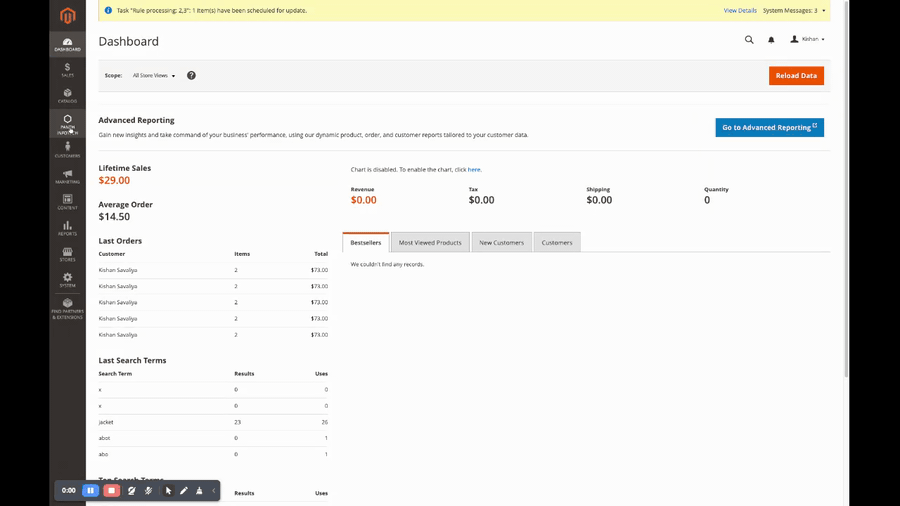
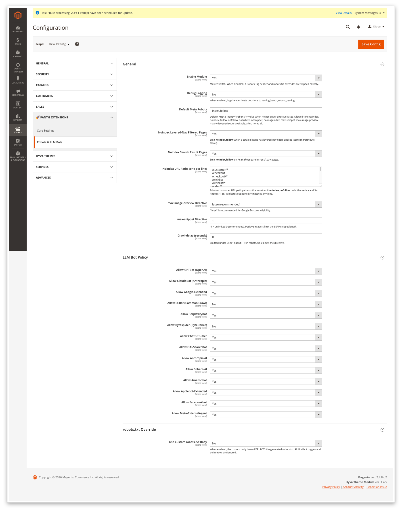
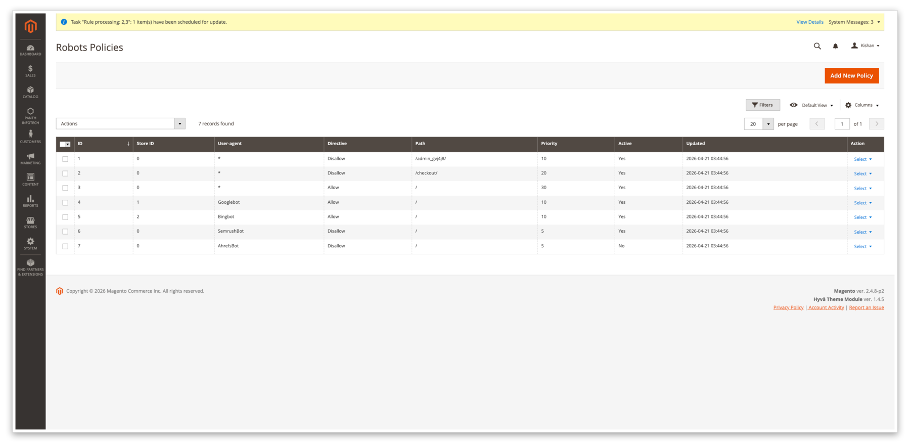
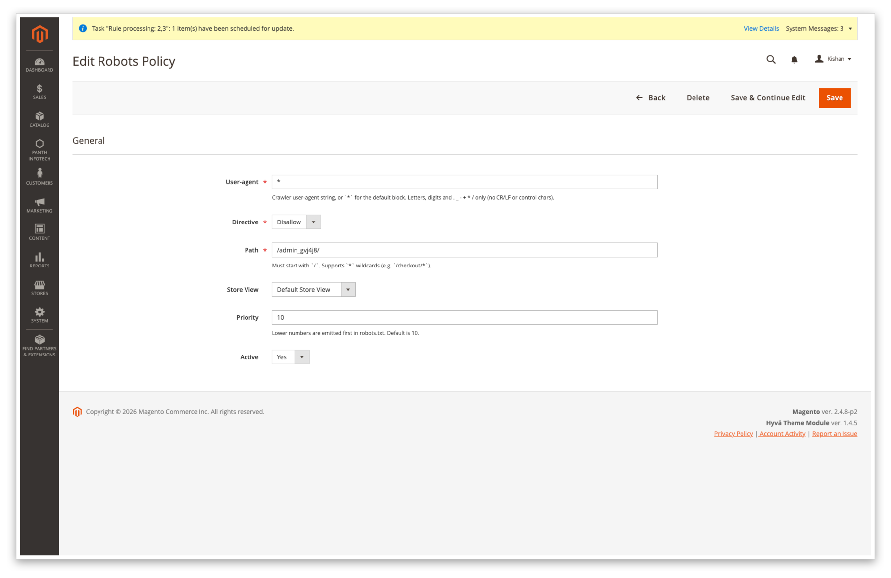
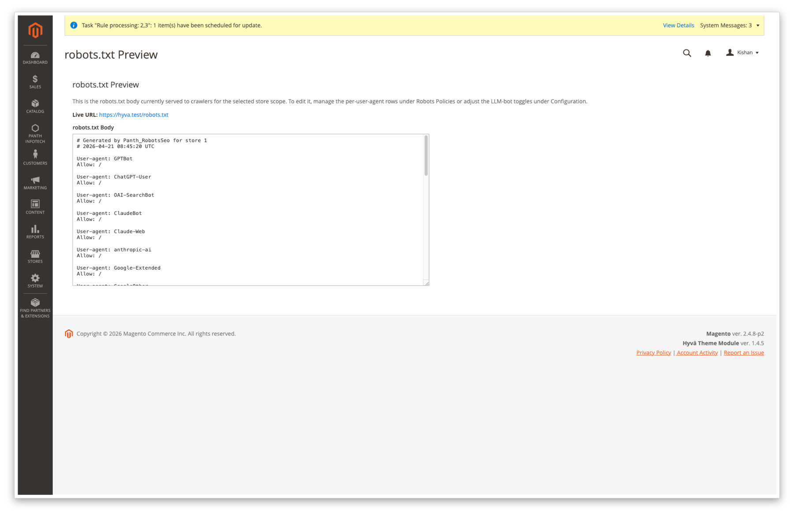

# Magento 2 Robots SEO

Panth Robots SEO gives a Magento 2 store control over how search engine crawlers and LLM crawlers are allowed to read it. It serves a generated `/robots.txt` per store view, sets an `X-Robots-Tag` header on every frontend response, rewrites the HTML `<meta name="robots">` tag to match, and adds an admin grid for per-user-agent allow and disallow rules.

The module replaces the `/robots.txt` router shipped with `Magento_Robots` with its own router and controller, so while the module is enabled the robots.txt textarea under Content > Design > Configuration is no longer what crawlers see. With the module disabled for a store view, /robots.txt is served exactly as Magento_Robots serves it. Merchants and SEO teams use it to keep customer, checkout, search and layered-navigation pages out of the index and to decide which LLM crawlers (GPTBot, ClaudeBot, PerplexityBot, Google-Extended, CCBot, Bytespider and others) may crawl the store. All of this happens at the controller and plugin level, so Hyva and Luma storefronts behave the same way.

Product page: [kishansavaliya.com/magento-2-robots-seo.html](https://kishansavaliya.com/magento-2-robots-seo.html)



## Features

- Generated `/robots.txt` per store view, assembled from the LLM crawler toggles, the Robots Policies grid, the crawl-delay, the `Sitemap:` lines (configured, or discovered from the sitemap files that exist) and a `Host:` line.
- Yes/No toggle per LLM crawler. A crawler set to No is written as `User-agent: <name>` followed by `Disallow: /`.
- Custom robots.txt body per store view that replaces the generated output.
- `X-Robots-Tag` response header on every frontend response: `noindex, nofollow` for 404, 410, 500 and 503 responses, for `.pdf`, `.doc`, `.docx`, `.xls` and `.xlsx` URLs and for configured private paths; `noindex, follow` for catalog search pages and layered-navigation filtered pages; otherwise the configured default directive.
- HTML `<meta name="robots">` rewritten with the same rules through a plugin on `Magento\Framework\View\Page\Config`. A value set by another module is merged with the resolved value and the stricter directive wins; the `X-Robots-Tag` header carries the same value.
- Noindex path list with `*` wildcards. A default list of 25 customer, checkout, wishlist, sales, contact and similar paths ships in `etc/config.xml`.
- List of query parameters (`utm_*`, `gclid`, `fbclid` and others) that do not mark a page as filtered, so landing URLs with only tracking parameters stay indexable.
- `max-image-preview` and `max-snippet` directives appended to the header and meta values.
- Robots Policies admin grid with add, edit, delete, mass enable, mass disable and mass delete, store view scope and priority, stored in the `panth_seo_robots_policy` table.
- Keyword search on the Robots Policies grid (user-agent, directive, path).
- robots.txt Preview page in the admin showing the body served for the default store view, with a link to the live URL.
- Every directive, user-agent and path passes `Service\DirectiveValidator` before it reaches a header or the robots.txt body. Directives with control characters, the characters `< > " ' & \` or unknown tokens are rejected; user-agents may only contain letters, digits, space and `. _ - + * /`; paths must start with `/` and must not contain control characters (other characters such as `&` and `?` are allowed because they occur in real URL paths).
- Optional debug log in `var/log/panth_robots_seo.log`.

## Compatibility

| Platform | Versions |
|---|---|
| Magento Open Source | 2.4.4, 2.4.5, 2.4.6, 2.4.7, 2.4.8 |
| Adobe Commerce | 2.4.4, 2.4.5, 2.4.6, 2.4.7, 2.4.8 |
| PHP | 8.1, 8.2, 8.3, 8.4 |
| Themes | Hyva, Luma |

Composer constraints from `composer.json`: `magento/framework ^103.0`, `magento/module-store ^101.1`, `magento/module-backend ^102.0`, `magento/module-config ^101.2`, `magento/module-catalog ^104.0`, `magento/module-cms ^104.0`, `magento/module-robots ^101.1`, `magento/module-ui ^101.2`.

## Requirements

- Magento Open Source or Adobe Commerce 2.4.4 to 2.4.8
- PHP `~8.1.0 || ~8.2.0 || ~8.3.0 || ~8.4.0`
- `mage2kishan/module-core` `^1.0` (`Panth_Core`; declares the Panth Extensions admin menu and configuration tab)
- Suggested: `hyva-themes/magento2-default-theme` when the storefront runs Hyva

The module declares a load sequence after `Panth_Core`, `Magento_Store`, `Magento_Backend`, `Magento_Catalog`, `Magento_Cms` and `Magento_Robots`.

## Installation

```bash
composer require mage2kishan/module-robots-seo
bin/magento module:enable Panth_Core Panth_RobotsSeo
bin/magento setup:upgrade
bin/magento setup:di:compile
bin/magento cache:flush
```

`setup:di:compile` is only needed in production mode. The module ships no files under `view/*/web`, so no static content deploy is required.

`setup:upgrade` runs three data patches: `InstallDefaultRobotsPolicy` seeds default policy rows when the table has no All Store Views rows, `InstallRobotsTxtRewrite` adds a `robots.txt` entry to `url_rewrite` for every store, and `RefreshRobotsTxtRewrite` re-points older `robots.txt` rewrites to this module's controller.

Check the result:

```bash
bin/magento module:status Panth_RobotsSeo
# STORE_URL is the base URL of the store view, without a trailing slash
curl -s "$STORE_URL/robots.txt"
curl -sI "$STORE_URL/customer/account/login" | grep -i x-robots-tag
```

## Configuration

Admin path: Stores > Configuration > Panth Extensions > Robots & LLM Bots (section id `panth_robots_seo`, ACL resource `Panth_RobotsSeo::config`). Every field can be set at default, website and store view scope; the module reads all values at store view scope.



### General (`panth_robots_seo/general/*`)

| Setting | Default | What it does |
|---|---|---|
| Enable Module (`enabled`) | Yes | Master switch for `/robots.txt`, the `X-Robots-Tag` header and the meta robots rewrite. When No, neither plugin changes the response and `/robots.txt` is served exactly as Magento_Robots serves it (the robots.txt instructions from Content > Design > Configuration, `Content-Type: text/plain`). |
| Debug Logging (`debug`) | No | When Yes, each `X-Robots-Tag` decision (URI, status code, directive) is written to `var/log/panth_robots_seo.log`. |
| Default Meta Robots (`default_directive`) | `index,follow` | Directive used when no noindex rule matches. Comma-separated tokens; allowed tokens are `index`, `noindex`, `follow`, `nofollow`, `noarchive`, `nosnippet`, `noimageindex`, `notranslate`, `max-snippet`, `max-image-preview`, `max-video-preview`, `unavailable_after`, `none` and `all`. `max-snippet` and `max-video-preview` need an integer value, `max-image-preview` needs `none`, `standard` or `large`. Saving an invalid value is refused with an error message; a blank value means `index,follow`. |
| Noindex Layered-Nav Filtered Pages (`noindex_filtered`) | Yes | Emits `noindex,follow` when the request carries `product_list_order`, `product_list_dir`, `product_list_limit` or `product_list_mode`, or any query parameter that is not `p`, `id`, `category`, `___store`, `___from_store` or one of the ignored parameters below. |
| Noindex Search Result Pages (`noindex_search_results`) | Yes | Emits `noindex, follow` on every URL under `/catalogsearch/`. |
| Query Parameters That Do Not Make A Page "Filtered" (`ignored_query_params`) | `utm_source, utm_medium, utm_campaign, utm_term, utm_content, utm_id, gclid, gbraid, wbraid, dclid, fbclid, msclkid, ttclid, twclid, li_fat_id, mc_cid, mc_eid, _gl, ref, affiliate, yclid, igshid, epik, s_kwcid` | Comma or whitespace separated, case-insensitive. Shown only when the filtered-pages option is Yes. Leave blank to treat every unknown parameter as a filter. |
| Noindex URL Paths (one per line) (`noindex_paths`) | 25 patterns: `/customer/*`, `/checkout`, `/checkout/*`, `/wishlist`, `/wishlist/*`, `/sales/*`, `/contact`, `/contact/*`, `/contacts`, `/contacts/*`, `/catalogsearch/*`, `/multishipping/*`, `/newsletter/manage`, `/newsletter/manage/*`, `/review/customer/*`, `/captcha`, `/captcha/*`, `/sendfriend/*`, `/paypal/*`, `/downloadable/customer/*`, `/vault/*`, `/giftcard/customer/*`, `/rewards/*`, `/oauth/*`, `/connect/*` | Paths that receive `noindex,nofollow` on both the meta tag and the header. One pattern per line; `*` matches anything; lines starting with `#` are ignored. Patterns are matched against the URL path without the query string, case-insensitively, and a trailing slash is optional. Leaving the field blank uses the built-in default list. |
| max-image-preview Directive (`max_image_preview`) | `large` | `large`, `standard` or `none`. Appended to the header and meta values; `none` omits the directive. |
| max-snippet Directive (`max_snippet`) | `-1` | Appended as `max-snippet:<value>`. `-1` means unlimited; a positive integer limits the snippet length. |
| Crawl-delay (seconds) (`crawl_delay`) | `0` | Written as `Crawl-delay:` under `User-agent: *` in robots.txt. `0` omits the line. |

### LLM Bot Policy (`panth_robots_seo/llm_bots/*`)

Each field is a Yes/No select. No writes `Disallow: /` for every user-agent listed for that field. Yes writes the active Robots Policies rows for that user-agent, or `Allow: /` when there are none.

| Setting | Default | User-agents written |
|---|---|---|
| Allow GPTBot (OpenAI) (`gptbot`) | Yes | `GPTBot` |
| Allow ClaudeBot (Anthropic) (`claudebot`) | Yes | `ClaudeBot`, `Claude-Web` |
| Allow Google-Extended (`google_extended`) | Yes | `Google-Extended`, `GoogleOther` |
| Allow CCBot (Common Crawl) (`ccbot`) | No | `CCBot` |
| Allow PerplexityBot (`perplexitybot`) | Yes | `PerplexityBot` |
| Allow Bytespider (ByteDance) (`bytespider`) | No | `Bytespider` |
| Allow ChatGPT-User (`chatgpt_user`) | Yes | `ChatGPT-User` |
| Allow OAI-SearchBot (`oai_searchbot`) | Yes | `OAI-SearchBot` |
| Allow Anthropic-AI (`anthropic_ai`) | Yes | `anthropic-ai` |
| Allow Cohere-AI (`cohere_ai`) | Yes | `cohere-ai` |
| Allow Amazonbot (`amazonbot`) | Yes | `Amazonbot` |
| Allow Applebot-Extended (`applebot_extended`) | Yes | `Applebot-Extended` |
| Allow Facebookbot (`facebookbot`) | Yes | `FacebookBot` |
| Allow Meta-ExternalAgent (`meta_externalagent`) | Yes | `meta-externalagent` |

`YouBot`, `PetalBot`, `Diffbot`, `AI2Bot`, `Omgilibot` and `Timpibot` have no toggle and are always written with `Allow: /`.

### robots.txt Override (`panth_robots_seo/robots_txt/*`)

| Setting | Default | What it does |
|---|---|---|
| Use Custom robots.txt Body (`override_enabled`) | No | When Yes, the custom body below replaces the generated robots.txt. Crawler toggles, policy rows, crawl-delay and sitemap lines are ignored. |
| Custom robots.txt Body (`custom_body`) | empty | Served as entered. CRLF and CR line endings are normalised to LF, null bytes are removed and a trailing newline is added. When the field is empty or only whitespace, the generated body is served instead. Shown only when the override is Yes. |
| Sitemap URL(s) (one per line) (`sitemap_urls`) | empty | One entry per line, written as `Sitemap:` lines. Accepts an absolute `http(s)` URL, a path starting with `/` (prefixed with the store base URL) or the `{{base_url}}` token. Duplicates are collapsed and entries that do not resolve to an `http(s)` URL are skipped. When blank, the sitemap index files that exist for the store view are listed: the active XML sitemap profiles of the store view (`panth_seo_sitemap_profile`, Output Path plus the profile's Sitemap Filename, or the `panth_xml_sitemap/generation/index_filename` file name for profiles without one; skipped when `panth_xml_sitemap/general/enabled` is No for the store view), or if none exists the Magento sitemap entries (`sitemap` table). Only files that exist under pub/ are listed, and no line is written when there is none. Shown only when the override is No. |

## Usage

### robots.txt

`GET /robots.txt` is answered by `Controller\Robots\Index` for the current store view with `Content-Type: text/plain; charset=utf-8`. When Enable Module is No for the store view, the controller renders the Magento_Robots page (`robots_index_index` handle and the `robotsResultPageFactory` result) instead, so the output is the same as without this module. The robots.txt response itself carries `X-Robots-Tag: noindex`. Unless the custom body override is on, the body is generated in this order:

1. Two comment lines with the store id and the generation time in UTC.
2. One block per LLM crawler: `User-agent: <name>` followed by `Disallow: /` when the toggle is No; when it is Yes, the active Robots Policies rows for that crawler, or `Allow: /` when it has none.
3. Active rows from the Robots Policies grid whose store view is the current store or All Store Views, grouped by user-agent and ordered by priority (lowest first). Each row becomes `Allow: <path>` or `Disallow: <path>`. Rows whose user-agent is one of the LLM crawler names from step 2 are written in step 2. If no row exists for `User-agent: *`, a built-in block is written instead with `Disallow:` lines for `/index.php/`, `/catalog/product_compare/`, `/catalog/category/view/`, `/catalog/product/view/`, `/catalogsearch/`, `/checkout/`, `/customer/`, `/customer/account/`, `/customer/account/login/`, `/newsletter/subscriber/new/`, `/review/product/`, `/sendfriend/`, `/wishlist/`, `/*?SID=`, `/*?___store=`, `/*?p=*&product_list_order=`, `/*?product_list_dir=`, `/*?product_list_limit=` and `/*?product_list_mode=`. `Crawl-delay:` is added under `User-agent: *` when the configured value is above 0.
4. The `Sitemap:` line(s) (see Sitemap URL(s) above; none when no sitemap file exists) and a `Host:` line with the host of the store base URL.

On first install `InstallDefaultRobotsPolicy` seeds, for All Store Views, seven `Disallow` rows for `User-agent: *` (`/checkout/`, `/customer/`, `/cart/`, `/catalogsearch/`, `/review/`, `/sendfriend/`, `/wishlist/`) and six `Allow /` rows for GPTBot, ClaudeBot, Google-Extended, CCBot, PerplexityBot and Bytespider. The six crawler rows are written under their crawler when the matching toggle is Yes. `ReseedDefaultRobotsPolicy` inserts any of these rows that are missing, for example when the table was recreated empty after the first patch had been recorded as applied.

Google's reference for the file format: [How Google interprets the robots.txt specification](https://developers.google.com/search/docs/crawling-indexing/robots/intro).

### X-Robots-Tag header

`Plugin\Response\XRobotsTagPlugin` runs before every frontend response is sent (frontend area only, module enabled, not `/robots.txt`) and sets the header using the first matching rule:

1. HTTP status 404, 410, 500 or 503: `noindex, nofollow`.
2. URL path ending in `.pdf`, `.doc`, `.docx`, `.xls` or `.xlsx`: `noindex, nofollow`.
3. Path under `/catalogsearch/` with Noindex Search Result Pages on: `noindex, follow`.
4. Path matching the Noindex URL Paths list: `noindex, nofollow`.
5. Otherwise the resolved default: `noindex,follow` when the request is a filtered listing (see the General group), or the Default Meta Robots value; `max-image-preview` and `max-snippet` are appended. When the meta robots plugin already set the header for the page, both values are merged and the stricter directive wins.

### Meta robots tag

`Plugin\Page\RobotsMetaPlugin` wraps `getRobots()` on the page config (frontend area only, module enabled, not `/robots.txt`) and returns, in order: `noindex,nofollow` for 404, 410, 500 and 503 responses and for the document extensions above; `noindex,follow` under `/catalogsearch/` when that option is on; `noindex,nofollow` for a matching noindex path; otherwise the incoming value (set by Magento or another module) merged with the resolved default and the `max-image-preview` and `max-snippet` directives, where the stricter directive wins. The merged value is also written to the `X-Robots-Tag` header, so the header and the meta tag match, including on full page cache hits. Every returned value is validated the same way as the header.

Google's reference for these directives: [Robots meta tag, data-nosnippet, and X-Robots-Tag specifications](https://developers.google.com/search/docs/crawling-indexing/robots-meta-tag).

### Admin

The admin menu Panth Extensions > Robots & LLM Bots has three entries:

- Robots Policies (`panth_robots_seo/policy/index`): grid with filters, mass Delete, Enable and Disable actions and per-row Edit and Delete. The edit form has User-agent (letters, digits, space and `. _ - + * /` only; `*` for the default block), Directive (Allow or Disallow), Path (must start with `/`; `*` wildcards are passed through to robots.txt), Store View (All Store Views or one store view), Priority (lower numbers are written first, default 10) and Active. User-agent and Path are format-checked in the browser and again on save.
- robots.txt Preview (`panth_robots_seo/robots/index`): read-only view of the body generated for the default store view and its live URL.
- Configuration: opens the Robots & LLM Bots section described above.







The module registers no cron jobs, console commands, observers or web API routes.

## Developer Notes

- Module name: `Panth_RobotsSeo`; Composer package: `mage2kishan/module-robots-seo`; PHP namespace: `Panth\RobotsSeo`; version 1.3.1.
- Service contract: `Api\RobotsPolicyInterface` with `getMetaRobots(string $entityType, int $entityId, int $storeId)`, `getHeaderRobots(...)`, `getRobotsTxt(int $storeId)` and `getLlmBotPolicy(int $storeId)`. Preference: `Model\Robots\PolicyResolver`, which also exposes the `LLM_BOT_CONFIG_MAP` and `LLM_BOTS` constants.
- `Model\Robots\MetaResolver` resolves the directive for a request and appends the advanced directives. When a `panth_seo_resolved` table exists (created by Panth_AdvancedSEO) it reads per-entity directives from it; the plugins shipped here call the resolver without an entity, so that lookup is only reached through the interface.
- `Service\DirectiveMerger::merge(string ...$values)` merges robots directive strings; `noindex`, `nofollow` and the other restrictive tokens win, and the smaller `max-snippet`, `max-video-preview` and `max-image-preview` values win.
- `Service\DirectiveValidator` (`isValidDirective`, `sanitizeDirective`, `isValidUserAgent`, `isValidPath`, `isValidAction`) and `Service\NoindexPathMatcher` (`isNoindexPath`, `getPatterns`) hold the validation and matching rules.
- `Helper\Config` exposes typed getters for every setting and the `XML_*` path constants.
- Plugins (frontend area, `etc/frontend/di.xml`): `Plugin\Response\XRobotsTagPlugin::beforeSendResponse` on `Magento\Framework\App\Response\Http` (sortOrder 10) and `Plugin\Page\RobotsMetaPlugin::afterGetRobots` on `Magento\Framework\View\Page\Config` (sortOrder 20).
- Preference (frontend area): `Magento\Robots\Controller\Router` is replaced by `Controller\Router\RobotsRouter`, which matches the path `robots.txt` and dispatches `Controller\Robots\Index`. The controller receives the `robotsResultPageFactory` virtual type from Magento_Robots and uses it when the module is disabled.
- Routes: frontend frontName `seo_robots` (`seo_robots/robots/index`); admin frontName `panth_robots_seo`.
- ACL resources: `Panth_RobotsSeo::manage` with children `Panth_RobotsSeo::robots`, `Panth_RobotsSeo::policies` and `Panth_RobotsSeo::policies_save` under `Panth_Core::panth_extensions`; `Panth_RobotsSeo::config` under `Magento_Config::config`.
- Table `panth_seo_robots_policy`: `policy_id`, `store_id` (foreign key to `store`, cascade delete), `user_agent`, `directive` (`allow` or `disallow`), `path`, `priority`, `is_active`, `updated_at`. The name is shared with Panth_AdvancedSEO so both modules can use the same rows.
- UI components: `panth_robots_seo_policy_listing` (data source `panth_robots_seo_policy_listing_data_source`, collection `Model\ResourceModel\RobotsPolicy\Grid\Collection`) and `panth_robots_seo_policy_form` (`Ui\Component\Form\DataProvider\PolicyFormDataProvider`).
- Logging: virtual types `Panth\RobotsSeo\Logger\Logger` and `Panth\RobotsSeo\Logger\Handler` write to `var/log/panth_robots_seo.log`.
- Data patches: `InstallDefaultRobotsPolicy`, `ReseedDefaultRobotsPolicy`, `InstallRobotsTxtRewrite`, `RefreshRobotsTxtRewrite`.
- Unit tests: `Test/Unit/Model/Robots/MetaResolverFilterParamsTest.php`, `Test/Unit/Service/DirectiveMergerTest.php`.

## Uninstallation

```bash
bin/magento module:disable Panth_RobotsSeo
composer remove mage2kishan/module-robots-seo
bin/magento setup:upgrade
bin/magento setup:di:compile
bin/magento cache:flush
```

Keep `Panth_Core` if other Panth extensions are installed. The module ships no uninstall script, so the following remain after removal: the `panth_seo_robots_policy` table and its rows, the `panth_robots_seo/*` values in `core_config_data`, the `robots.txt` rows in `url_rewrite` (description `Panth_RobotsSeo dynamic robots.txt`), and `var/log/panth_robots_seo.log` if debug logging was used. Once the module is removed, Magento's own robots.txt handling applies again.

## Support

- Product page: [kishansavaliya.com/magento-2-robots-seo.html](https://kishansavaliya.com/magento-2-robots-seo.html)
- Contact: [kishansavaliya.com/contact](https://kishansavaliya.com/contact)
- Email: kishansavaliyakb@gmail.com
- GitHub issues: [github.com/mage2sk/module-robots-seo/issues](https://github.com/mage2sk/module-robots-seo/issues)

## License

Proprietary, as declared in `composer.json`. The package is published on Packagist and can be installed with Composer; see the product page for the terms of use.

## Changelog

See [CHANGELOG.md](CHANGELOG.md).

## Links

- Website: [kishansavaliya.com](https://kishansavaliya.com)
- All extensions: [kishansavaliya.com/magento-extensions.html](https://kishansavaliya.com/magento-extensions.html)
- GitHub: [github.com/mage2sk/module-robots-seo](https://github.com/mage2sk/module-robots-seo)
- Packagist: [packagist.org/packages/mage2kishan/module-robots-seo](https://packagist.org/packages/mage2kishan/module-robots-seo)
